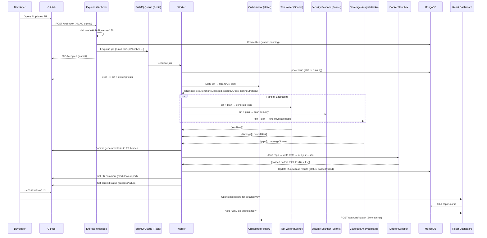
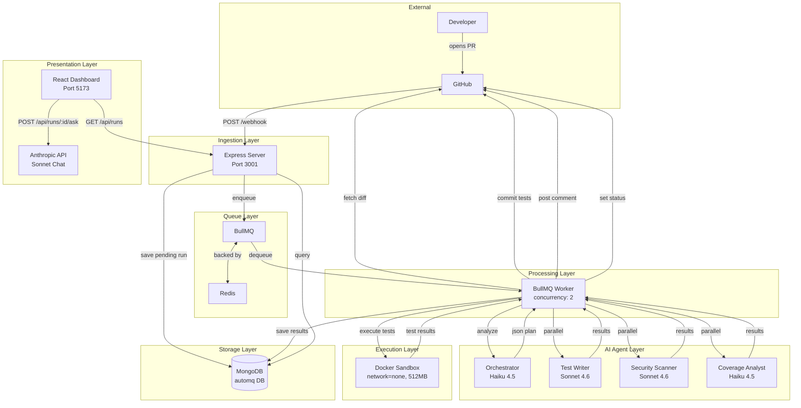
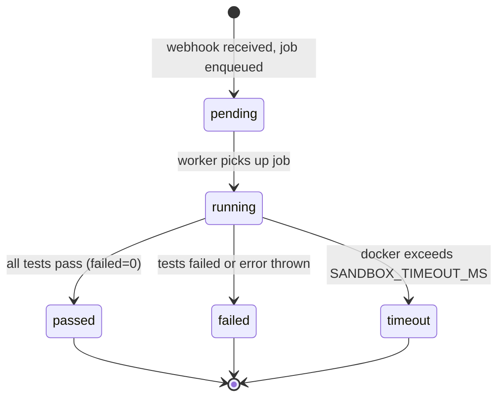
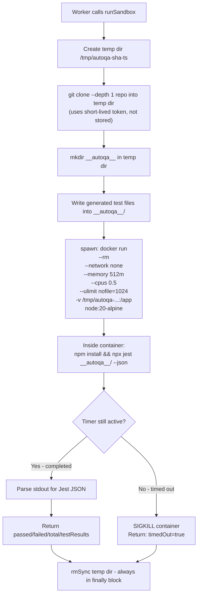
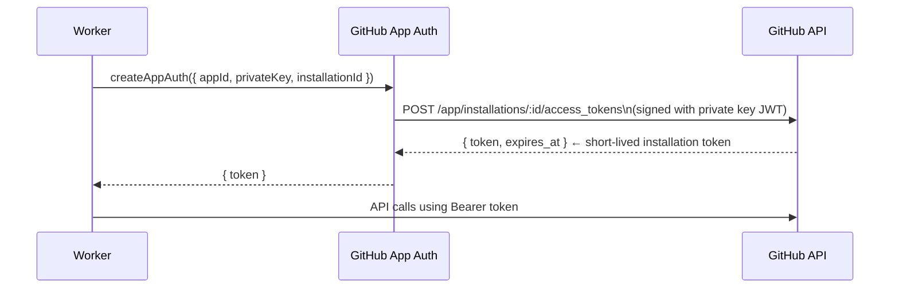
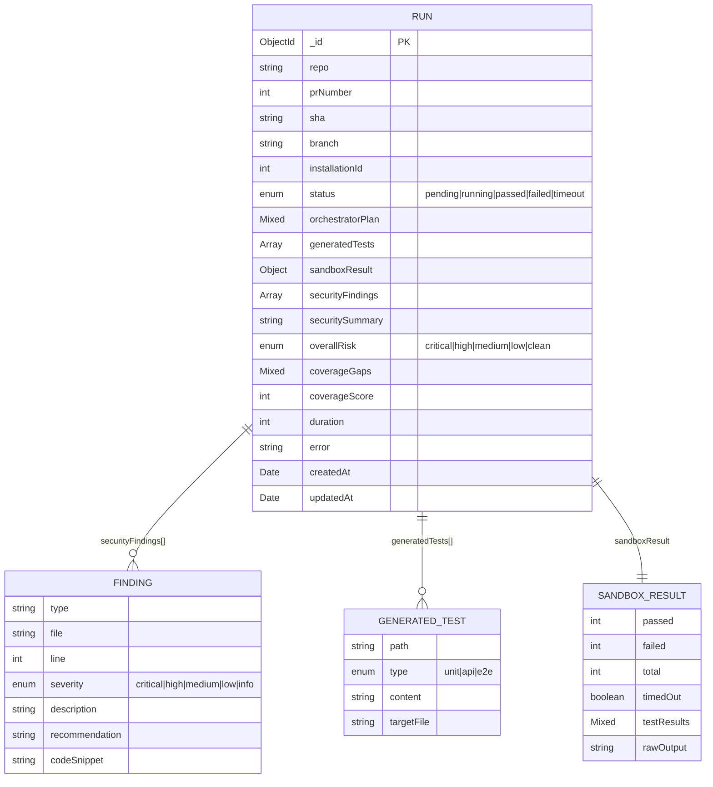
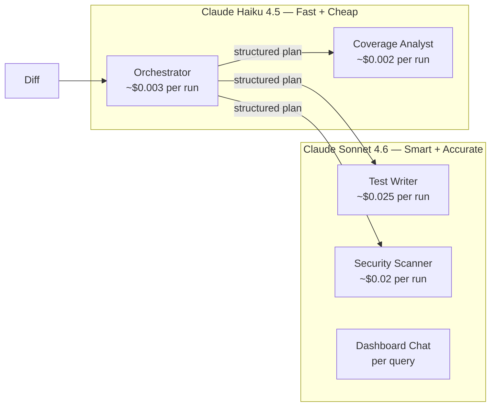
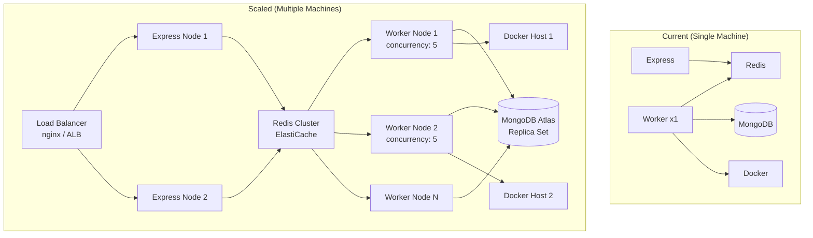
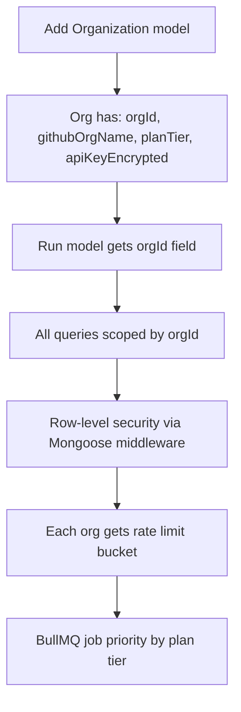
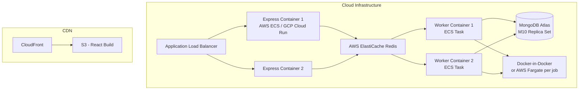

# AutoQA — Comprehensive Architecture Document

> **Purpose:** A deep-dive reference for the AutoQA (PRbøt) project — covering system design, database modelling, component internals, and interview-ready answers. Simple language, precise reasoning.

---

## Table of Contents

1. [What is AutoQA?](#1-what-is-autoqa)
2. [High-Level Design (HLD)](#2-high-level-design-hld)
   - [System Components](#21-system-components)
   - [Full Data-Flow Diagram](#22-full-data-flow-diagram)
   - [Component Interaction Diagram](#23-component-interaction-diagram)
3. [Low-Level Design (LLD)](#3-low-level-design-lld)
   - [Webhook Ingestion](#31-webhook-ingestion--routeswebhookjs)
   - [Queue Layer](#32-queue-layer--queueindexjs--queueworkerjs)
   - [Agent Pipeline](#33-agent-pipeline)
   - [Docker Sandbox](#34-docker-sandbox--sandboxrunnerjs)
   - [GitHub Integration](#35-github-integration--githubclientjs)
   - [REST API](#36-rest-api--routesapijs)
   - [Frontend](#37-frontend--react--vite)
4. [Database Modelling](#4-database-modelling)
   - [Why MongoDB and Not PostgreSQL?](#41-why-mongodb-and-not-postgresql)
   - [Schema Deep-Dive](#42-schema-deep-dive)
   - [Indexes and Query Patterns](#43-indexes-and-query-patterns)
5. [AI Agent Design](#5-ai-agent-design)
   - [Model Routing Strategy](#51-model-routing-strategy)
   - [Prompt Engineering Choices](#52-prompt-engineering-choices)
   - [Retry and Resilience](#53-retry-and-resilience)
6. [Security Design](#6-security-design)
   - [Webhook Verification](#61-webhook-verification)
   - [Sandbox Isolation](#62-sandbox-isolation)
   - [Secrets Management](#63-secrets-management)
7. [Scalability Design](#7-scalability-design)
   - [Current Bottlenecks](#71-current-bottlenecks)
   - [Scaling to More Repos and Users](#72-scaling-to-more-repos-and-users)
   - [Multi-Tenant Architecture](#73-multi-tenant-architecture)
8. [Interview Q&A — System Design](#8-interview-qa--system-design)
9. [Interview Q&A — Database Choices](#9-interview-qa--database-choices)
10. [Interview Q&A — AI and Agents](#10-interview-qa--ai-and-agents)
11. [Interview Q&A — Security and Reliability](#11-interview-qa--security-and-reliability)
12. [Interview Q&A — Scaling and Production](#12-interview-qa--scaling-and-production)
13. [Trade-offs Summary](#13-trade-offs-summary)

---

## 1. What is AutoQA?

AutoQA is an agentic AI system that acts like an automated QA engineer for your GitHub pull requests. When a developer opens or updates a PR, AutoQA automatically:

1. Reads the git diff of the PR
2. Plans a testing strategy using an AI orchestrator
3. Generates Jest/Playwright test code using AI
4. Scans the diff for security vulnerabilities using AI
5. Identifies untested code paths using AI
6. Executes the generated tests inside an isolated Docker container
7. Posts a detailed report directly on the PR as a comment
8. Sets a pass/fail commit status visible on the PR

The developer never leaves GitHub — they see the results directly on their PR.

**The key innovation:** Multiple AI agents with different specializations work in a planned, coordinated pipeline. This is not a single Claude prompt — it is a multi-agent system with an orchestrator directing specialist agents.

---

## 2. High-Level Design (HLD)

### 2.1 System Components

| Component | Technology | Role |
|-----------|------------|------|
| Webhook Receiver | Express.js | Accepts GitHub webhook events, validates signatures, enqueues jobs |
| Message Queue | Redis + BullMQ | Decouples ingestion from processing; handles retries and concurrency |
| Worker | BullMQ Worker (Node.js) | Runs the full pipeline for each PR event |
| Orchestrator Agent | Claude Haiku 4.5 | Analyzes the diff, creates a structured JSON execution plan |
| Test Writer Agent | Claude Sonnet 4.6 | Generates runnable Jest/Playwright tests from the plan |
| Security Scanner Agent | Claude Sonnet 4.6 | Identifies security vulnerabilities in the changed code |
| Coverage Analyst Agent | Claude Haiku 4.5 | Identifies untested code paths and coverage gaps |
| Docker Sandbox | Docker (node:20-alpine) | Isolated, network-disabled container that runs generated tests |
| Database | MongoDB + Mongoose | Stores run history, results, findings, generated tests |
| GitHub Integration | Octokit + GitHub App | Reads diffs, commits tests, posts PR comments, sets commit status |
| Frontend Dashboard | React 18 + Vite | Shows run history, charts, detailed results, chat interface |

### 2.2 Full Data-Flow Diagram



### 2.3 Component Interaction Diagram



---

## 3. Low-Level Design (LLD)

### 3.1 Webhook Ingestion (`routes/webhook.js`)

**What happens in detail when GitHub sends a webhook:**

```
POST /webhook
  ├── 1. Check X-Hub-Signature-256 header exists → 401 if missing
  ├── 2. Compute HMAC: sha256(GITHUB_WEBHOOK_SECRET, req.rawBody)
  ├── 3. crypto.timingSafeEqual(computed, header) → 401 if mismatch
  ├── 4. Check event type: ignore anything not 'pull_request'
  ├── 5. Check action: only process 'opened' and 'synchronize'
  ├── 6. Extract { sha, prNumber, repo, branch, installationId }
  ├── 7. new Run({ ...fields, status: 'pending' }).save() → MongoDB
  ├── 8. addJob({ runId, sha, prNumber, repo, branch, installationId })
  └── 9. res.status(202).json({ runId }) → instant response
```

**Critical detail — raw body capture:**
The raw request buffer must be captured *before* `express.json()` parses the body, because `express.json()` replaces `req.body` with the parsed object. HMAC validation requires the exact raw bytes GitHub signed.

```javascript
app.use((req, res, next) => {
  let data = []
  req.on('data', chunk => data.push(chunk))
  req.on('end', () => {
    req.rawBody = Buffer.concat(data)  // capture before parsing
    next()
  })
})
app.use(express.json())  // parse AFTER
```

### 3.2 Queue Layer (`queue/index.js` + `queue/worker.js`)

**Why a queue exists at all:**

GitHub expects an HTTP response within 10 seconds. The full pipeline (AI calls + Docker execution) takes 30–120 seconds. Without a queue, the webhook handler would time out. The queue receives the job in milliseconds, the worker does the heavy lifting in the background.



**Retry policy:**
```javascript
queue.add('process-pr', data, {
  attempts: 2,               // try up to 2 times
  backoff: {
    type: 'exponential',
    delay: 5000              // 5s → 10s between retries
  }
})
```

**Concurrency:** The worker uses `concurrency: 2`, so at most 2 PR pipelines run simultaneously on a single worker instance. This prevents overwhelming the host machine, Claude API, and Docker daemon.

**Critical ioredis requirement:** BullMQ requires `maxRetriesPerRequest: null` on the ioredis connection. Without it, ioredis will throw an error when BullMQ blocks on a Redis stream read command.

### 3.3 Agent Pipeline

**Step-by-step worker execution:**

```
1. Mark Run as 'running' in MongoDB
2. Authenticate with GitHub using App credentials → get short-lived installation token
3. Fetch PR diff (raw patch format, truncated to 50,000 chars to stay under context limits)
4. Fetch up to 5 existing test files from the repo (for style matching)
5. Orchestrator(diff) → returns JSON plan
6. Promise.all([
     testWriter(diff, plan, existingTests),
     securityScanner(diff, plan),
     coverageAnalyst(diff, plan, existingTests)
   ]) → runs all three agents in parallel
7. Commit generated test files to the PR branch via GitHub API
8. Docker sandbox → clone repo → write tests → run Jest → parse results
9. Save full result to MongoDB
10. Format and post PR comment
11. Set commit status on the SHA
```

**Why Promise.all on the three agents?**
The Test Writer, Security Scanner, and Coverage Analyst are each given the orchestrator's plan as input. They do not depend on each other's outputs. Running them in parallel cuts total AI latency roughly by 3x — from ~60s sequential to ~20s parallel.

### 3.4 Docker Sandbox (`sandbox/runner.js`)

The sandbox is the most security-critical part of the system. It executes AI-generated code, which must never be trusted.



**Sandbox constraints explained:**

| Flag | Value | Why |
|------|-------|-----|
| `--network none` | disabled | Prevents tests from exfiltrating secrets, hitting internal endpoints, or downloading malware |
| `--memory 512m` | 512 MB | Prevents a runaway test from OOM-killing the host |
| `--cpus 0.5` | half a core | Limits CPU so other runs aren't starved |
| `--ulimit nofile=1024:1024` | 1024 file handles | Prevents file descriptor exhaustion attacks |
| `--rm` | auto-delete | Container deleted immediately after exit, no orphans |
| `--depth 1` clone | shallow clone | Only fetches the latest commit, faster and less data transferred |

**Output parsing:** Jest's `--json` flag writes structured output to stdout, but mixed with npm install noise. The parser walks backwards through stdout lines until it finds one that parses as valid JSON — this is the Jest report.

### 3.5 GitHub Integration (`github/client.js`)

AutoQA uses **GitHub App** authentication, not a personal access token (PAT). Here is why that matters:

```
Personal Access Token:
  - Tied to one user account
  - Broad permissions, hard to scope
  - If rotated, must update everywhere manually
  - Cannot work across organizations without adding as member

GitHub App:
  - Installed on specific repositories
  - Fine-grained per-permission (read PR, write commit status, etc.)
  - Generates short-lived tokens (1 hour TTL) per installation
  - Can be installed by any org without granting user-level access
  - Scales to any number of repos and orgs
```

**Token flow:**



**commitGeneratedTests — how tests are committed without a checkout:**

Rather than running `git` locally, the function uses the GitHub low-level Git API to build a commit tree entirely in memory:
1. Get the current commit SHA (head of the branch)
2. Get the tree SHA that commit points to
3. Create a blob for each test file
4. Create a new tree with those blobs under `__autoqa__/`
5. Create a new commit object (parent = current head)
6. Update the branch ref to point at the new commit

This is fast (no clone needed) and works server-side without any git tooling.

### 3.6 REST API (`routes/api.js`)

| Endpoint | Method | Description |
|----------|--------|-------------|
| `/api/runs` | GET | Last 50 runs, projection to exclude large fields like generatedTests |
| `/api/runs/stats` | GET | Aggregated metrics: totalRuns, passRate, avgCoverage, findingsBySeverity |
| `/api/runs/:id` | GET | Full run document including all findings and test output |
| `/api/runs/:id/ask` | POST | Chat with Claude Sonnet about this specific run's results |
| `/api/health` | GET | Server health: mongo connection state + BullMQ job counts |

**`/api/runs/stats` aggregation pipeline:**
```javascript
Run.aggregate([
  { $match: { createdAt: { $gte: thirtyDaysAgo } } },
  { $group: {
    _id: null,
    totalRuns: { $sum: 1 },
    passedRuns: { $sum: { $cond: [{ $eq: ['$status', 'passed'] }, 1, 0] } },
    avgCoverageScore: { $avg: '$coverageScore' },
    allFindings: { $push: '$securityFindings' }
  }}
])
// Then flatten allFindings array and group by severity in JS
```

### 3.7 Frontend (`React + Vite`)

The frontend is a read-mostly React SPA. It calls the backend REST API using browser `fetch`.

```mermaid
graph TD
    A[App.jsx - BrowserRouter] --> B[/ → Dashboard.jsx]
    A --> C[/runs/:id → RunDetail.jsx]
    B --> D[TrendChart.jsx\nRecharts LineChart\n14-day pass rate]
    B --> E[SeverityDonut.jsx\nRecharts PieChart\nfindings breakdown]
    B --> F[RunTable.jsx\nlast 50 runs\nclickable rows]
    C --> G[Tests Tab\nassertionResults list]
    C --> H[Security Tab\nfindings cards]
    C --> I[Coverage Tab\ncoverageScore + gaps]
    C --> J[AskAboutRun.jsx\nchat widget\nPOST /api/runs/:id/ask]
```

**Vite proxy:** In development, Vite proxies `/api` requests to `http://localhost:3001`. This eliminates CORS issues in development without needing to configure the backend differently.

---

## 4. Database Modelling

### 4.1 Why MongoDB and Not PostgreSQL?

This is a common interview question. Here is the honest, nuanced answer:

**Arguments for MongoDB (chosen):**

1. **Schema flexibility for AI outputs.** AI agents return structured JSON, but the exact shape can evolve as prompts change. If the Orchestrator agent's output schema changes (adding a new field like `complexity`), there is no migration needed — MongoDB just stores the new field alongside existing documents. With PostgreSQL, you'd need an `ALTER TABLE` for every prompt iteration.

2. **Document-per-run fits naturally.** A `Run` is a self-contained unit. Its security findings, coverage gaps, test results, and orchestrator plan all belong to that run and are almost always queried together. Embedding them in a single MongoDB document avoids JOINs and mirrors the data structure in memory.

3. **AI output is semi-structured.** Fields like `orchestratorPlan` (a complex nested object), `coverageGaps` (variable-length array of objects), and `sandboxResult.testResults` (deeply nested) do not map cleanly to flat relational tables without a complex schema or a JSONB column anyway.

4. **Write-heavy workload.** Each PR run writes a large document once, then reads it a few times for the dashboard. MongoDB's write throughput is excellent for this insert-heavy pattern.

5. **No cross-document transactions needed.** Each run is independent. We never need ACID transactions that span multiple runs.

**Where PostgreSQL would be better:**

1. If you needed to query *across* fields (e.g., "all findings of type X across all repos"), MongoDB's aggregation pipeline works but is less ergonomic than SQL.
2. If you needed strong referential integrity (e.g., a `users` table that runs belong to), SQL foreign keys enforce this automatically.
3. For complex reporting with many dimensions (business intelligence queries), SQL is typically more powerful.

**The honest trade-off:**

| Factor | MongoDB | PostgreSQL |
|--------|---------|------------|
| Schema flexibility | ✅ Great for evolving AI schemas | ❌ Needs migrations |
| Nested data | ✅ Native document model | ⚠️ JSONB column or many JOINs |
| Complex analytics | ⚠️ Aggregation pipeline | ✅ SQL is more expressive |
| Transactions | ⚠️ Added in v4, less mature | ✅ First-class ACID |
| Developer familiarity | ✅ Easy for MERN stack | ✅ Very well known |
| Write throughput | ✅ Excellent | ✅ Good |

**Bottom line:** MongoDB is the right choice here because the primary use case is "store a complex, semi-structured AI output document once, retrieve it once." If analytical querying across runs became a primary feature, you'd either add an Elasticsearch index or migrate to a data warehouse.

### 4.2 Schema Deep-Dive



**Field-by-field explanation:**

| Field | Type | Why it exists |
|-------|------|---------------|
| `repo` | String | Format: `owner/repo`. Primary identifier for filtering by repository |
| `prNumber` | Number | GitHub PR number. Combined with `repo`, uniquely identifies a PR |
| `sha` | String | Commit SHA. Used to set commit status and clone the exact code version |
| `branch` | String | Branch name. Used to clone the PR branch for sandbox execution |
| `installationId` | Number | GitHub App installation ID. Used to generate the installation auth token |
| `status` | Enum | Current pipeline state. Enum enforces valid values at the DB level |
| `orchestratorPlan` | Mixed | The raw JSON plan from the Orchestrator agent. Mixed type because this schema evolves |
| `generatedTests` | Array | Each object has path, type, content, targetFile. Stored so dashboard can show what was generated |
| `sandboxResult` | Object | Structured test results: pass/fail counts and per-assertion results |
| `securityFindings` | Array of subdocuments | Each finding has its own sub-schema with severity enum enforcement |
| `overallRisk` | Enum | Aggregated risk level from the security scanner. Used for dashboard filtering |
| `coverageGaps` | Mixed | Array of gap objects from the coverage analyst. Mixed because structure may evolve |
| `coverageScore` | Number | 0-100 estimate. Stored as a number for dashboard aggregation |
| `duration` | Number | Milliseconds from job start to completion. Used for performance monitoring |
| `error` | String | Error message if the pipeline threw. Allows debugging failed runs |
| `createdAt/updatedAt` | Date | Auto-managed by Mongoose timestamps. Used for time-range queries |

### 4.3 Indexes and Query Patterns

```javascript
runSchema.index({ repo: 1, createdAt: -1 })  // Index 1
runSchema.index({ prNumber: 1, repo: 1 })     // Index 2
```

**Index 1 — `{ repo: 1, createdAt: -1 }`:**
Used by the `GET /api/runs` query that fetches the last 50 runs, optionally filtered by repo. A compound index covering both fields lets MongoDB scan only documents for that repo, sorted by time, without a collection scan.

**Index 2 — `{ prNumber: 1, repo: 1 }`:**
Used to check "has this PR already been processed?" or to find all runs for a specific PR number. Compound because PR numbers are not globally unique — `PR #5` exists in every repository.

**Query pattern analysis:**

| Query | Endpoint | Index used |
|-------|----------|------------|
| Last 50 runs (all repos) | GET /api/runs | `createdAt` desc (via index 1 partial scan) |
| Runs for one repo | GET /api/runs?repo=x | Index 1 (repo + createdAt) |
| Single run by ID | GET /api/runs/:id | Default `_id` index |
| Stats last 30 days | GET /api/runs/stats | `createdAt` range scan |
| Find runs for a PR | Internal | Index 2 (prNumber + repo) |

---

## 5. AI Agent Design

### 5.1 Model Routing Strategy

One of the most important design decisions is **which model to use for each task**. Using a large, expensive model for everything is wasteful. Using a small model for everything means poor results.



**Routing logic:**

| Agent | Model | Reasoning |
|-------|-------|-----------|
| Orchestrator | Haiku | Reads diff, classifies changes, outputs JSON. Routing and classification does not require deep reasoning — Haiku is fast and cheap |
| Coverage Analyst | Haiku | Identifies what is not tested. Another classification/tagging task, not code generation |
| Test Writer | Sonnet | Must generate correct, runnable code. A hallucinated import path or wrong mock makes the test fail. Quality matters here |
| Security Scanner | Sonnet | Nuanced vulnerability detection requires understanding subtle patterns like NoSQL injection, IDOR, and timing attacks. Haiku misses these |
| Dashboard Chat | Sonnet | Conversational reasoning over a large JSON context (full run document). Needs strong comprehension |

**Cost estimate:** ~$0.03–0.08 per PR run. Under $5/month for an active development team.

### 5.2 Prompt Engineering Choices

**1. Strict JSON-only output:**
Every agent's system prompt says: *"Return ONLY valid JSON. No markdown, no backticks, no explanation."* This is critical because:
- The output is directly `JSON.parse()`d in application code
- Markdown code fences (` ```json ``` `) break parsing
- Explanatory text before/after JSON breaks parsing

**2. Schema in the system prompt:**
Each agent is given the exact expected JSON schema in its system prompt. This dramatically reduces hallucination of unknown fields and ensures the parser finds what it expects.

**3. Temperature = 0:**
All agents use `temperature: 0`. This makes outputs deterministic and reproducible. For code generation, creative variation is harmful — you want the same good pattern every time.

**4. Context injection in user message:**
The orchestrator's plan is injected into the Test Writer, Security Scanner, and Coverage Analyst's user messages. This is "chaining" — the output of one agent becomes the context of the next, allowing downstream agents to focus their effort on the highest-risk areas identified by the Orchestrator.

**5. Existing test style injection:**
The Test Writer receives 2 existing test files from the repo as examples. This guides the model to match the project's testing conventions — if the project uses `describe/it`, the generated tests use the same pattern; if it mocks dependencies a certain way, generated tests follow suit.

### 5.3 Retry and Resilience

Every agent call is wrapped in a recursive `callWithRetry` function:

```
First call → LLM returns text
  ├── JSON.parse succeeds → return parsed object ✅
  └── JSON.parse fails → call again with:
        "IMPORTANT: Return ONLY valid JSON. No other text whatsoever."
        ├── JSON.parse succeeds → return parsed object ✅
        └── JSON.parse fails → throw error (do not recurse further)
```

This handles the most common failure mode: the LLM adding an apology, a preamble, or markdown formatting around its JSON response. One retry resolves this in nearly 100% of cases.

---

## 6. Security Design

### 6.1 Webhook Verification

Every incoming webhook is verified before any processing:

```
Incoming request
├── Header: X-Hub-Signature-256: sha256=<hex>
├── Body: raw JSON bytes
└── Secret: GITHUB_WEBHOOK_SECRET (shared, stored in env)

Verification:
1. server computes: 'sha256=' + HMAC-SHA256(secret, rawBody).hex
2. uses crypto.timingSafeEqual() to compare
   └── Regular === comparison is vulnerable to timing attacks:
       short-circuit on first mismatch reveals how many chars match
       timingSafeEqual always takes the same time regardless of match
3. Reject if not equal → prevents anyone from forging webhook events
```

**Why this matters:** Without signature verification, anyone who knows your webhook URL can trigger AutoQA runs with fake PR events, wasting Claude API credits and potentially cloning arbitrary repos.

### 6.2 Sandbox Isolation

The sandbox uses multiple layers of isolation:

| Layer | Protection |
|-------|------------|
| `--network none` | Generated tests cannot make HTTP requests, connect to databases, or exfiltrate data |
| `--memory 512m` | Prevents memory exhaustion attacks on the host |
| `--cpus 0.5` | Prevents CPU starvation of other processes |
| `--rm` flag | Container is deleted immediately after exit, no persistence |
| Temp directory | Files written to `/tmp/autoqa-...` and deleted in a `finally` block regardless of success/failure |
| `--depth 1` clone | Minimal git history transferred, reduces attack surface |
| Short-lived token | The GitHub token used to clone expires in 1 hour and is not stored |

**What could still go wrong:**
- A test could write large files to disk (mitigated partially by the `ulimit nofile`)
- A test could consume all available CPU via a busy loop (mitigated by `--cpus`)
- Future improvement: add `--read-only` flag or a disk quota

### 6.3 Secrets Management

| Secret | Storage | How it's loaded |
|--------|---------|-----------------|
| `ANTHROPIC_API_KEY` | `.env` file (gitignored) | `process.env` |
| `GITHUB_WEBHOOK_SECRET` | `.env` file | `process.env` |
| `GITHUB_APP_PRIVATE_KEY_BASE64` | `.env` file as base64 string | `Buffer.from(..., 'base64').toString()` |
| `MONGODB_URI` | `.env` file | `process.env` |
| `REDIS_URL` | `.env` file | `process.env` |
| Installation token | In-memory only | Generated at runtime, discarded after use |

**Why base64 for the private key?** `.pem` private keys contain newlines. Many environment variable systems (especially in CI/CD) do not handle multiline values well. Encoding as base64 makes it a single string, then we decode it in `config/index.js` at startup.

---

## 7. Scalability Design

### 7.1 Current Bottlenecks

In its current form (single Node.js server + worker + Redis + MongoDB), the system has these limits:

| Component | Current Limit | Bottleneck |
|-----------|---------------|------------|
| Worker concurrency | 2 jobs | `MAX_CONCURRENT_JOBS=2`, single process |
| Docker daemon | Host's CPU/RAM | All containers run on the same host |
| Claude API | Rate limits (tokens/min) | Shared across all concurrent runs |
| MongoDB | Single node | No replication, no sharding |
| Redis | Single node | No replication |
| Express | Single process | No load balancing |

### 7.2 Scaling to More Repos and Users



**Scaling steps, in order of ROI:**

**Step 1: Scale workers horizontally**
The BullMQ worker is completely stateless with respect to in-memory data. Any worker that connects to the same Redis queue will pick up and process jobs. Deploy more worker processes (even on the same machine) or deploy workers on separate machines. Zero code changes needed — just start more worker processes.

**Step 2: Scale Express horizontally**
Express is also stateless. Put multiple Express instances behind nginx or an AWS Application Load Balancer. Session state (if added) would need to go into Redis, not in-process memory.

**Step 3: Managed Redis (ElastiCache / Upstash)**
Replace single-node Redis with a managed Redis cluster. BullMQ supports Redis Cluster. This removes the queue as a single point of failure.

**Step 4: Managed MongoDB (MongoDB Atlas)**
Replace single-node MongoDB with Atlas replica set. Replicas handle read scaling; writes still go to the primary. For very high read load, add read replicas and direct dashboard queries to replicas.

**Step 5: Docker execution infrastructure**
Move sandbox execution from the local Docker daemon to a dedicated container execution service (AWS ECS, Google Cloud Run, or Kubernetes Jobs). This decouples test execution from the worker machine's resources.

**Step 6: Claude API rate limits**
At high volume, you hit Anthropic's tokens-per-minute limits. Mitigations:
- Request rate limit increases from Anthropic
- Implement a token bucket rate limiter before Claude calls
- Use BullMQ's `limiter` option to throttle job processing to stay within API limits

### 7.3 Multi-Tenant Architecture

If AutoQA becomes a SaaS product (multiple organizations using it), the architecture needs these additions:



**Data isolation:** Add an `orgId` field to every `Run` document. Add a Mongoose pre-find middleware that automatically injects `{ orgId: req.user.orgId }` into every query, ensuring tenants can never see each other's data.

**Fair queuing:** Use BullMQ's job priority system to give paying customers' jobs higher priority than free-tier jobs.

**Per-tenant API keys:** Store Anthropic API keys per organization (encrypted at rest with AES-256), allowing orgs to use their own Claude quota.

---

## 8. Interview Q&A — System Design

**Q: Why use a message queue instead of processing webhook events directly in the request handler?**

**A:** Two reasons:

First, GitHub requires a webhook response within 10 seconds or it marks the delivery as failed and retries. The full AutoQA pipeline takes 30–120 seconds (AI calls + Docker execution). If we processed synchronously, the request would always time out.

Second, the queue provides durability and retry logic. If the server crashes mid-processing, the job is still in Redis and will be picked up when the server restarts. Without a queue, that processing would be lost permanently.

---

**Q: How does the system handle two PRs being opened simultaneously?**

**A:** BullMQ is configured with `concurrency: 2`, so up to 2 jobs run in parallel on a single worker. Additional jobs wait in the Redis queue. If more concurrency is needed, more workers are spun up — each connects to the same Redis queue and picks up available jobs. The worker code is stateless, so horizontal scaling is trivial.

---

**Q: What happens if the Anthropic Claude API is down?**

**A:** The BullMQ job will fail (the `await anthropic.messages.create()` call will throw). The error is caught, the Run document is marked `failed` with the error message, and a failure commit status is set on GitHub. BullMQ's retry policy will attempt the job again (up to 2 attempts with exponential backoff). If the API is down for an extended period, jobs pile up in the queue and are processed when service resumes.

---

**Q: Why does the system use GitHub App authentication instead of a personal access token?**

**A:** GitHub Apps are the correct mechanism for automating interactions with many repositories:
- Tokens are scoped to specific repositories, not a user's entire account
- Tokens expire in 1 hour, limiting the blast radius of a leak
- Apps can be installed on any org or repo without adding a user as a collaborator
- Fine-grained permissions (only the exact permissions the app needs)
- Works at scale — a PAT is tied to one person who might leave the team

---

**Q: How do you prevent race conditions when the same PR receives multiple webhook events quickly?**

**A:** Currently, each webhook event creates a new Run document independently. Multiple runs for the same PR can exist (which is actually useful — you can see the history of every push to the PR). This is not a bug.

For future improvement: add a check before creating a Run to see if there's already a `running` job for this `repo + prNumber`. If so, either skip or cancel the in-progress run.

---

**Q: How would you add support for monorepos where only one sub-package changed?**

**A:** The Orchestrator agent already identifies which files changed in the diff. We could extend its output schema with a `changedPackages` field. The test writer would then only target the relevant packages. The Docker sandbox execution would also be targeted — instead of running all tests, it would run `jest --testPathPattern=packages/changed-package`.

---

## 9. Interview Q&A — Database Choices

**Q: Why did you choose MongoDB over PostgreSQL for this project?**

**A:** The primary reason is schema flexibility for AI outputs. The Orchestrator returns a complex, nested JSON plan; the security scanner returns an array of findings with variable structure; the coverage analyst returns gap objects. These structures can evolve as prompts change without requiring database migrations.

Additionally, each PR run is a self-contained document. The findings, test results, and coverage data all belong to one run and are almost always read together. This is the perfect use case for MongoDB's document model — the data you write is the data you query, without JOINs.

If the product needed heavy cross-run analytics (e.g., "show me all SQL injection vulnerabilities found across all repos in the last quarter"), I'd either add Elasticsearch for full-text search on findings or use a data warehouse for analytics, keeping MongoDB as the operational database.

---

**Q: How would you handle the case where runs grow to millions of documents?**

**A:** Several strategies:

1. **TTL Index:** Add a TTL index on `createdAt` to automatically delete runs older than 90 days: `runSchema.index({ createdAt: 1 }, { expireAfterSeconds: 7776000 })`

2. **Archival:** Move old runs to cold storage (S3 as JSONL). Query recent runs from MongoDB, older runs from S3 on demand.

3. **Sharding:** If the collection gets too large for one MongoDB node, shard on `{ repo: 1 }` so runs for each repo are co-located on the same shard. Dashboard queries filtered by repo go to one shard.

4. **Projection:** The `GET /api/runs` list endpoint already uses projection to exclude large fields (`generatedTests`, `sandboxResult.rawOutput`). This keeps the list query fast even on large documents.

---

**Q: Why are indexes defined on `{ repo: 1, createdAt: -1 }` and not just `{ createdAt: -1 }`?**

**A:** The compound index serves queries that filter by repo AND sort by date. MongoDB can use a compound index for queries that use a prefix of the index keys. So `{ repo: 1, createdAt: -1 }` can serve:
- Queries filtering by `repo` only
- Queries filtering by `repo` AND sorting by `createdAt`
- Queries filtering by `repo` AND sorting by `createdAt` in reverse

A single `{ createdAt: -1 }` index would only help the "last N runs across all repos" query. The compound index is more versatile.

---

**Q: Would you use Redis just for the queue, or for caching too?**

**A:** In the current system, Redis is used only for BullMQ. As the system scales, Redis is a natural fit for caching the `/api/runs/stats` aggregation result, which runs an expensive aggregation over 30 days of data. Cache with a 5-minute TTL using Redis `SET stats:global <json> EX 300`. Each new run completes would invalidate the cache. This would make the dashboard stats near-instant.

---

## 10. Interview Q&A — AI and Agents

**Q: What makes this system "agentic" vs. just calling an LLM API?**

**A:** Three characteristics make this agentic:

1. **Planning:** The Orchestrator agent reads a diff and produces a structured plan that directs what other agents do. It's not just answering a question — it's deciding the work breakdown.

2. **Coordination:** The Orchestrator's plan is injected as context into the Test Writer, Security Scanner, and Coverage Analyst. Agents are not independent one-shot calls — they are coordinated through structured information passing.

3. **Real-world action:** The system takes actions with consequences: it commits code to a branch, posts a comment on a PR, and sets a commit status. It is not just generating text — it is operating on external systems.

---

**Q: How do you deal with the LLM returning bad/hallucinated test code that won't run?**

**A:** Two-layer defense:

1. **In the LLM prompt:** The Test Writer's system prompt instructs it to match existing test style, mock all external dependencies, and use valid relative import paths. Style examples from the repo are injected to ground the output.

2. **In execution:** The Docker sandbox will actually run the generated tests. If the code is syntactically invalid, Jest will throw a parse error. If imports are wrong, the test fails with a module-not-found error. These failures are captured and surfaced in the dashboard and PR comment. The system does not pretend tests passed when they failed.

This is actually a key design advantage: the system validates its own AI-generated output through real execution.

---

**Q: What if the diff is too large for the Claude context window?**

**A:** The system truncates the diff to 50,000 characters before sending it to agents. This is a hard limit defined in the worker. For very large diffs, this means the tail of the diff (later files changed) may be cut off.

Better solutions for production:
1. **Summarize the diff in chunks:** Split the diff by file, summarize each file's changes with Haiku, then pass the summaries to Sonnet.
2. **Prioritize by risk:** The Orchestrator could identify the 5 highest-risk files, and subsequent agents would only receive those files' diffs.
3. **Streaming:** Use Claude's streaming API to handle partial outputs gracefully.

---

**Q: Why don't you keep conversation history between agent calls (multi-turn)?**

**A:** Each agent call is single-turn by design for several reasons:
- Simplicity: no state management between calls
- Cost: conversation history grows the context and increases token costs
- Parallelism: stateless calls can run in parallel via `Promise.all`
- Correctness: agents receive exactly the information they need — the orchestrator plan — not the history of previous turns which could confuse them

The only multi-turn component is the Dashboard Chat (`AskAboutRun`), where conversation history is maintained client-side and sent with each question to give the LLM context.

---

## 11. Interview Q&A — Security and Reliability

**Q: How do you ensure the system is resilient if MongoDB goes down?**

**A:** Currently:
- Webhook ingestion fails → GitHub marks delivery as failed and retries up to 3 times over several hours
- Worker processing fails → BullMQ catches the error, marks the job failed, retries if attempts remain

For production resilience:
- MongoDB Atlas replica set with automatic failover (usually < 30 seconds)
- The BullMQ queue persists in Redis, so jobs are not lost during a MongoDB outage
- A dead-letter queue pattern: jobs that fail max retries go to a `failed` queue for manual inspection

---

**Q: What is the risk of a developer using AutoQA to exfiltrate secrets from their own repo?**

**A:** The biggest risk would be a malicious commit that adds a test file that reads `.env` or sensitive config files and posts them somewhere. AutoQA's mitigations:
- `--network none` means the container cannot make outbound HTTP calls to exfiltrate
- The container only mounts the repo directory, not the host filesystem
- The test runner uses `--json` output; arbitrary stdout is captured but not executed
- The short-lived GitHub token used for cloning has minimal permissions and expires in 1 hour

This is still worth documenting as a known limitation — a test could write secrets to its assertion output (which we capture). For a production system, scanning the rawOutput for secret patterns would be a valuable addition.

---

**Q: How do you prevent someone from triggering expensive Claude API calls by spamming webhook events?**

**A:** Several layers:
1. Webhook signature validation rejects any request not from GitHub
2. BullMQ concurrency limit (`MAX_CONCURRENT_JOBS=2`) caps parallel AI calls
3. Only `opened` and `synchronize` PR events are processed — not every GitHub event

For production, add:
- A per-installation rate limit (e.g., max 20 runs per hour per GitHub App installation) using a Redis counter
- BullMQ's built-in `limiter` option: `new Worker('autoqa-jobs', fn, { limiter: { max: 10, duration: 60000 } })`

---

## 12. Interview Q&A — Scaling and Production

**Q: How would you add real-time updates to the dashboard so users don't have to refresh?**

**A:** Add WebSockets using `socket.io` or native WebSocket to the Express server. When the worker updates a Run's status (running → passed/failed), emit a `run:updated` event with the run ID. The React dashboard subscribes to this event and updates the specific run's status in its local state without a full page refresh. This is a common pattern for job status UIs.

---

**Q: How would you deploy this to production?**

**A:**



Key decisions for production:
1. **Containerize** Express and Worker as separate Docker images
2. **Separate scaling** — scale workers and API nodes independently
3. **React build** hosted on S3 + CloudFront (no server needed for frontend)
4. **Secrets** in AWS Secrets Manager or similar, not `.env` files
5. **Monitoring** — Datadog/Grafana for BullMQ queue depth, Claude API latency, sandbox execution time
6. **Logging** — Structured JSON logs to a log aggregator (Datadog Logs, CloudWatch)

---

**Q: How would you add support for testing Python or Java repositories, not just Node.js?**

**A:** The core pipeline is language-agnostic up to the sandbox runner. Changes needed:

1. **Orchestrator:** Detect the language from file extensions in the diff (`*.py`, `*.java`).
2. **Test Writer:** Select a different system prompt based on language (pytest for Python, JUnit for Java).
3. **Sandbox Runner:** Switch Docker base images (`python:3.12-alpine` for Python, `eclipse-temurin:21-alpine` for Java) and test commands (`pytest --json-report` for Python, `mvn test` for Java).
4. **Output parsing:** Each test runner has a different JSON output format — add a parser per runner type.

The architecture supports this extension cleanly because the sandbox runner is already parameterized by `testFiles` — you just need to add image selection logic.

---

## 13. Trade-offs Summary

| Decision | Choice Made | Alternative | Why This Choice |
|----------|-------------|-------------|-----------------|
| Database | MongoDB | PostgreSQL | Schema-flexible for evolving AI outputs |
| Queue | BullMQ + Redis | AWS SQS, RabbitMQ | Easy setup, great Node.js library, persistent |
| AI Provider | Anthropic Claude | OpenAI GPT, Groq | Quality reasoning + code generation; can swap in 3 lines |
| Test Runner | Jest | Vitest, Mocha | Most widely used, excellent JSON output mode |
| Sandbox | Docker | VM, gVisor, Firecracker | Available everywhere, simple to configure |
| Auth | GitHub App | OAuth, PAT | Correct for multi-repo automation, short-lived tokens |
| Frontend | React + Vite | Next.js, plain HTML | Fast SPA; SSR not needed for a dashboard |
| Parallelism | Promise.all for 3 agents | Sequential | 3x faster; agents are independent |
| Model routing | Haiku for planning, Sonnet for generation | All Sonnet | ~60% cost reduction with minimal quality loss |
| Diff truncation | 50,000 chars hard cut | Chunking/summarization | Simple; handles most diffs; noted as a known limitation |

---

*Generated for AutoQA (PRbøt) — AI-Powered GitHub PR Testing Agent*
